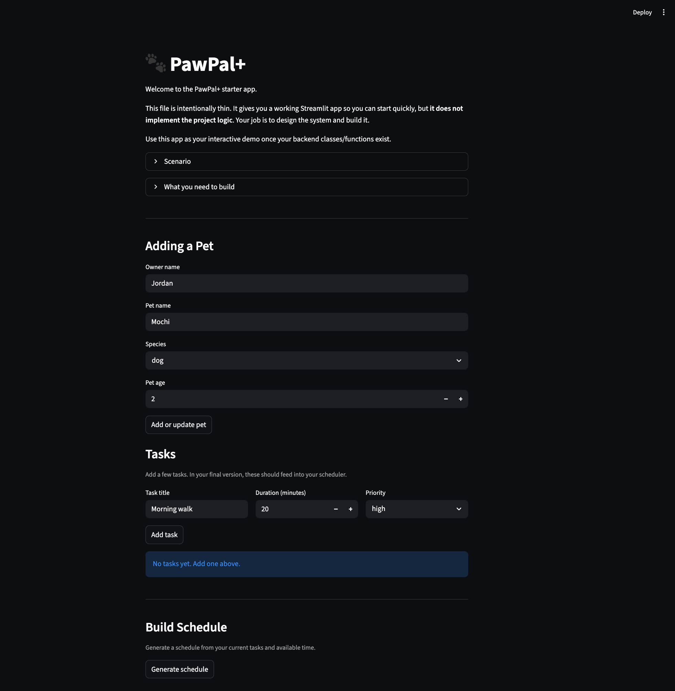

# PawPal+ (Module 2 Project)

You are building **PawPal+**, a Streamlit app that helps a pet owner plan care tasks for their pet.

## Scenario

A busy pet owner needs help staying consistent with pet care. They want an assistant that can:

- Track pet care tasks (walks, feeding, meds, enrichment, grooming, etc.)
- Consider constraints (time available, priority, owner preferences)
- Produce a daily plan and explain why it chose that plan

Your job is to design the system first (UML), then implement the logic in Python, then connect it to the Streamlit UI.

## What you will build

Your final app should:

- Let a user enter basic owner + pet info
- Let a user add/edit tasks (duration + priority at minimum)
- Generate a daily schedule/plan based on constraints and priorities
- Display the plan clearly (and ideally explain the reasoning)
- Include tests for the most important scheduling behaviors

## Smarter Scheduling

Recent scheduler updates improve day-to-day planning quality:

- Cross-pet task support when building and filtering schedules
- Sorting by both priority and time-of-day for clearer daily ordering
- Completion-aware filtering so only active tasks are scheduled
- Lightweight conflict detection that warns when tasks share the same time (instead of crashing)

## Features

PawPal+ includes a scheduling engine with clear, test-backed decision rules:

- Priority-based scheduling under a fixed time budget:
	- Uses a greedy planner that selects tasks in priority order (`high` > `medium` > `low`) while total minutes stay within the owner's available time.
	- When priorities are equal, tasks are tie-broken by shorter duration first, then alphabetical title order for deterministic results.
- Chronological sorting by time-of-day:
	- Supports HH:MM ordering for daily routines (for example, `07:30` before `08:00`).
	- Tasks without a set time are automatically placed at the end of the list.
- Conflict warnings for overlapping times:
	- Detects when two or more tasks share the same `time_of_day`.
	- Returns non-blocking warning messages so users can adjust plans without app crashes.
- Completion-aware filtering:
	- Filters tasks by completion state (`completed=True/False`) to focus planning on active work.
	- Supports optional pet-name filtering (case-insensitive) for multi-pet households.
- Daily and weekly recurrence generation:
	- Marking a `daily` task complete creates the next occurrence due tomorrow.
	- Marking a `weekly` task complete creates the next occurrence due in 7 days.
	- Non-recurring tasks (for example, `once`) are completed without auto-creating a new task.
- Cross-pet planning support:
	- Scheduler can gather tasks across all pets owned by the same owner, enabling household-level planning and conflict checks.
- Explainable plan output:
	- Produces both machine-readable plan data (scheduled tasks, skipped tasks, time used, remaining minutes) and human-readable reasoning for each include/skip decision.

## 📸 Demo

Final Streamlit app screenshot:

<a href="app_demo.png" target="_blank">
	
</a>

## Getting started

### Setup

```bash
python -m venv .venv
source .venv/bin/activate  # Windows: .venv\Scripts\activate
pip install -r requirements.txt
```

### Suggested workflow

1. Read the scenario carefully and identify requirements and edge cases.
2. Draft a UML diagram (classes, attributes, methods, relationships).
3. Convert UML into Python class stubs (no logic yet).
4. Implement scheduling logic in small increments.
5. Add tests to verify key behaviors.
6. Connect your logic to the Streamlit UI in `app.py`.
7. Refine UML so it matches what you actually built.

## Testing PawPal+

Run the test suite with:

```bash
python -m pytest
```

Current tests cover core scheduling behaviors, including chronological sorting by time-of-day, recurring task creation when daily tasks are completed, task filtering, and conflict detection when two tasks share the same scheduled time.

Confidence Level: ★★★★★ (5/5), based on the latest test run result (`13 passed`).
