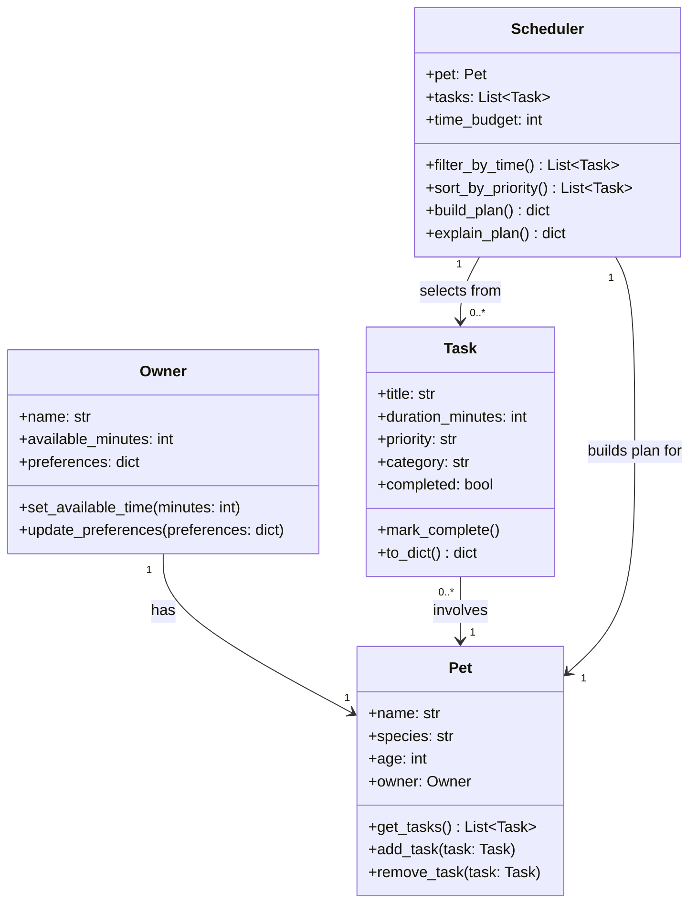

# PawPal+ Project Reflection

## 1. System Design

**a. Initial design**

- Briefly describe your initial UML design.
- What classes did you include, and what responsibilities did you assign to each?
  
The revised UML design uses four classes for easier implementation. Owner holds the owner's name and daily time budget. Pet holds the pet's name, species, and age, and is linked to one Owner. Task represents a single care action with a title, duration, priority, and category, and each Task involves one Pet. Scheduler takes a Pet and its Task list, filters and sorts tasks by priority and available time, then returns plan data directly (scheduled tasks, skipped tasks, total time used, and reasoning) instead of using a separate DailyPlan class. For this project scope, one Owner has one Pet, and the Scheduler builds a plan for the Pet by selecting from its Tasks.

Owner Class:
Attributes: name, available_minutes (daily time budget), preferences (e.g., preferred task order or times)
Methods: set_available_time(), update_preferences()

Pet Class:
Attributes: name, species, age, owner
Methods: get_tasks(), add_task(task), remove_task(task)

Task Class:
Attributes: title, duration_minutes, priority ("low" / "medium" / "high"), category (e.g., walk, feeding, meds), completed
Methods: mark_complete(), to_dict() (for display/storage)

Scheduler Class:
Attributes: pet, tasks, time_budget
Methods:
filter_by_time() — drop tasks that won't fit
sort_by_priority() — rank remaining tasks
build_plan() — return scheduled_tasks, skipped_tasks, and total_time_used
explain_plan() — return human-readable reasoning for each inclusion/exclusion

**b. Design changes**

- Did your design change during implementation?
- If yes, describe at least one change and why you made it.
Yes, I changed my design during implementation:
1. Added stricter priority typing on Task.priority to Literal["low", "medium", "high"] in pawpal_system.py:24.
2. Added explicit Task.pet relationship (Pet | None) in pawpal_system.py:26 to match your UML “Task involves one Pet” model.
3. Made Scheduler.tasks and Scheduler.time_budget optional in pawpal_system.py:57 and pawpal_system.py:58, so later logic can safely default to pet.tasks and owner.available_minutes and avoid dual-source drift.

---

## 2. Scheduling Logic and Tradeoffs

**a. Constraints and priorities**

- What constraints does your scheduler consider (for example: time, priority, preferences)?
	My scheduler considers time budget, task priority, completion status, and time-of-day collisions. It only schedules tasks that fit within the owner's available minutes, sorts by priority (high to low), uses incomplete tasks for planning, and warns when two tasks share the same scheduled time.
- How did you decide which constraints mattered most?
	I prioritized time budget and task priority first because they most directly affect whether the schedule is realistic and whether important care tasks happen. Completion filtering and conflict warnings were added to improve day-to-day reliability without making the core logic too complex.

**b. Tradeoffs**

- Describe one tradeoff your scheduler makes.
	A key tradeoff is using a greedy priority-first approach instead of a full optimization approach. The scheduler may not always maximize total task coverage, because it chooses higher-priority tasks first when time is limited.
- Why is that tradeoff reasonable for this scenario?
	This tradeoff is reasonable because PawPal+ is a practical daily assistant, not an advanced optimization system. The greedy method is faster, easier to explain, and easier to test, while still ensuring critical pet-care tasks are more likely to be included.

---

## 3. AI Collaboration

**a. How you used AI**

- How did you use AI tools during this project (for example: design brainstorming, debugging, refactoring)?
- What kinds of prompts or questions were most helpful?

**b. Judgment and verification**

- Describe one moment where you did not accept an AI suggestion as-is.
- How did you evaluate or verify what the AI suggested?

---

## 4. Testing and Verification

**a. What you tested**

- What behaviors did you test?
- Why were these tests important?

**b. Confidence**

- How confident are you that your scheduler works correctly?
- What edge cases would you test next if you had more time?

---

## 5. Reflection

**a. What went well**

- What part of this project are you most satisfied with?

**b. What you would improve**

- If you had another iteration, what would you improve or redesign?

**c. Key takeaway**

- What is one important thing you learned about designing systems or working with AI on this project?
